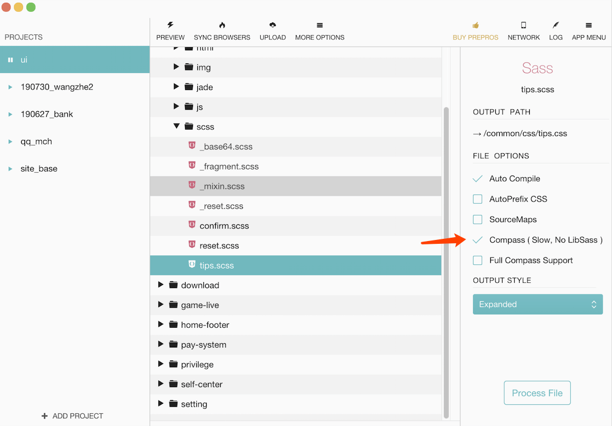
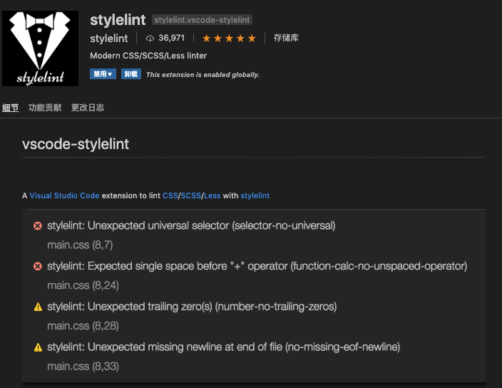
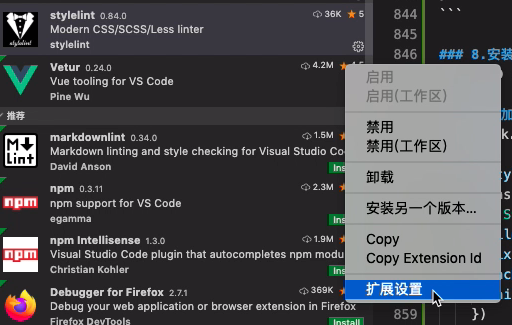
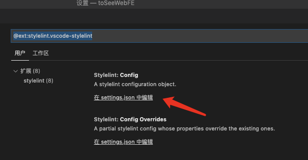

# CSS编码规范
[TOC]

## 前言
为前端开发提供良好的样式编码风格指南。

基于 [Airbnb](https://github.com/airbnb/css) 编码规范结合实际使用进行制定。

**必须（Mandatory）** 级别要求必须严格按照规范的编码格式编写，否则会在代码扫描和自动化构建中报错。

**推荐（Preferable）** 级别希望尽量按照规范编写，但如有特殊情况，可以不采用。

**可选（Optional）** 级别并不对编码提出要求，但仍希望按参考规范编写。将定期review编码规范，不断提高规范等级要求。

## 1. 术语

### 1.1 规则声明

我们把一个（或一组）选择器和一组属性称之为 “规则声明”。举个例子：

```scss
.listing {
  font-size: 18px;
  line-height: 1.2;
}
```


### 1.2 选择器

在规则声明中，“选择器” 负责选取 DOM 树中的元素，这些元素将被定义的属性所修饰。选择器可以匹配 HTML 元素，也可以匹配一个元素的类名、ID, 或者元素拥有的属性。以下是选择器的例子：

```scss
.my-element-class {
  /* ... */
}

[aria-hidden] {
  /* ... */
}
```


### 1.3 属性

最后，属性决定了规则声明里被选择的元素将得到何种样式。属性以键值对形式存在，一个规则声明可以包含一或多个属性定义。以下是属性定义的例子：

```scss
.some-selector {
  background: #f1f1f1;
  color: #333;
}
```


## 2. CSS

本节的规范也适用于Sass/less等预编译语言，建议使用Sass进行开发。

用[Prettier](https://marketplace.visualstudio.com/items?itemName=esbenp.prettier-vscode)美化器美化后可以让代码满足第4、5、6、7点以及第9点颜色值变小写的要求。


### 2.1 格式

[2.1.1](<#2.1.1>)<a id="2.1.1"></a> **【必须】** 使用 2 个空格作为缩进。stylelint: `indentation`

**Bad**

```scss
.avatar {
    border-radius:50%;
}
```

**Good**

```scss
.avatar {
  border-radius: 50%;
}
```

[2.1.2](<#2.1.2>)<a id="2.1.2"></a> **【推荐】** 类名建议使用破折号代替驼峰法，推荐使用BEM方式命名。

BEM，也就是 “Block-Element-Modifier”，是一种用于 HTML 和 CSS 类名的*命名约定*。BEM 最初是由 Yandex 提出的，要知道他们拥有巨大的代码库和可伸缩性，BEM 就是为此而生的，并且可以作为一套遵循 OOCSS 的参考指导规范。

**Bad**

```scss
.listingCard {
  /* ... */
}
```

**Good**

```scss
/* listing-card 是一个块（block），表示高层次的组件 */
.listing-card {
  /* ... */
}

/*listing-card__title 是一个元素（element），它属于 .listing-card 的一部分，因此块是由元素组成的。*/
.listing-card__title {
  /* ... */
}

/*listing-card--featured 是一个修饰符（modifier），表示这个块与 .listing-card 有着不同的状态或者变化。*/
.listing-card--featured {
  /* ... */
}
```

[2.1.3](<#2.1.3>)<a id="2.1.3"></a> **【必须】** 不要使用 ID 选择器。 sytlelint: `selector-max-id`
在 CSS 中，虽然可以通过 ID 选择元素，但大家通常都会把这种方式列为反面教材。ID 选择器给你的规则声明带来了不必要的高[优先级](https://developer.mozilla.org/en-US/docs/Web/CSS/Specificity)，而且 ID 选择器是不可重用的。
想要了解关于这个主题的更多内容，参见 [CSS Wizardry 的文章](http://csswizardry.com/2014/07/hacks-for-dealing-with-specificity/)，文章中有关于如何处理优先级的内容。

ps: `selector-no-id` 已经从stylelint v7.12.0 废除，使用 `selector-max-id: 1` 代替

**Bad**

```scss
#title {
  border-radius:50%;
}
```

**Good**

```scss
.title {
  border-radius: 50%;
}
```

[2.1.4](<#2.1.4>)<a id="2.1.4"></a> **【必须】** 在一个规则声明中应用了多个选择器时，每个选择器独占一行。stylelint: `selector-list-comma-newline-after`

（本规则可以用[Prettier](https://marketplace.visualstudio.com/items?itemName=esbenp.prettier-vscode)美化器美化器来满足。）

**Bad**

```scss
.one, .selector, .per-line {
  /* ... */
}
```

**Good**

```scss
.one,
.selector,
.per-line {
  /* ... */
}
```

[2.1.5](<#2.1.5>)<a id="2.1.5"></a> **【必须】** 在规则声明的左大括号 `{` 前加上一个空格。 stylelint: `block-opening-brace-space-before`

（本规则可以用[Prettier](https://marketplace.visualstudio.com/items?itemName=esbenp.prettier-vscode)美化器美化器来满足。）

**Bad**

```scss
.one{
  /* ... */
}
```

**Good**

```scss
.one {
  /* ... */
}
```

[2.1.6](<#2.1.6>)<a id="2.1.6"></a> **【必须】** 在属性的冒号 `:` 后面加上一个空格，前面不加空格。stylelint: `declaration-colon-space-after`  `declaration-colon-space-before`

（本规则可以用[Prettier](https://marketplace.visualstudio.com/items?itemName=esbenp.prettier-vscode)美化器美化器来满足。）

**Bad**

```scss
.avatar {
  border-radius:50%;
  background:#ffffff;
  border:.02rem solid white;
}
```

**Good**

```scss
.avatar {
  border-radius: 50%;
  background: #fff;
  border: .02rem solid white;
}
```

[2.1.7](<#2.1.7>)<a id="2.1.7"></a> **【必须】** 规则声明的右大括号 `}` 独占一行。stylelint: `block-closing-brace-newline-before`

（本规则可以用[Prettier](https://marketplace.visualstudio.com/items?itemName=esbenp.prettier-vscode)美化器美化器来满足。）

**Bad**

```scss
.avatar {
  border-radius:50%;
  background:#ffffff;
  border:0.02rem solid white; }
```

**Good**

```scss
.avatar {
  border-radius: 50%;
  background: #fff;
  border: .02rem solid white;
}
```

[2.1.8](<#2.1.8>)<a id="2.1.8"></a> **【推荐】** 颜色值用小写，能用三个字来表示，则推荐用三个字来表示。stylelint `color-hex-length: sort` `color-hex-case: lower`

**Bad**

```scss
.foo {
  background: #ABCDEF;
}

.bar {
  background: #ffffff;
}
```

**Good**

```scss
.foo {
  background: #abcdef;
}

.bar {
  background: #fff;
}
```

[2.1.9](<#2.1.9>)<a id="2.1.9"></a> **【必须】** 不要使用`!important`。stylelint: `declaration-no-important`


**Bad**

```scss
.avatar {
  border: .02rem solid white !important;
}
```

**Good**

```scss
.avatar {
  border: .02rem solid white;
}
```

[2.1.10](<#2.1.10>)<a id="2.1.10"></a> **【必须】** 在定义无边框样式时，使用 `0` 代替 `none`。stylelint: `declaration-property-value-disallowed-list`       

uses:    

```javascript
{
  // ...
  "declaration-property-value-disallowed-list": [
    {
      "/^border/": ["none"]
    }
  ]
}
```

**Bad**

```scss
.foo {
  border: none;
}
```

**Good**

```scss
.foo {
  border: 0;
}
```

[2.1.11](<#2.1.11>)<a id="2.1.11"></a> **【推荐】** before、after、active、focus等状态只使用一个`:`。 stylelint: `selector-pseudo-element-colon-notation`

**Bad**

```scss
.item {
  &::before{
      content: "";
  }
  &::after{
      content: "";
  }
}

input {
  &::active{
      background: #f00;
  }
  &::focus{
      background: #ff0;
  }
}
```

**Good**

```scss
.item {
  &:before{
    content: '';
  }
  &:after{
    content: '';
  }
}

input {
  &:active{
    background: #f00;
  }
  &:focus{
    background: #ff0;
  }
}
```

[2.1.12](<#2.1.12>)<a id="2.1.12"></a> **【推荐】** 样式中不要添加浏览器前缀，由编译工具自动添加。stylelint: `value-no-vendor-prefix`

**Bad**

```scss
.item {
  -webkit-box-sizing: border-box;
  -webkit-transform: scale(.5);
  -moz-transform: scale(.5);
  -ms-transform: scale(.5);
}
```

**Good**

```scss
.item {
  box-sizing: border-box;
  transform: scale(.5);
}
```

[2.1.13](<#2.1.13>)<a id="2.1.13"></a> **【必须】** 禁止小于1的小数前加0。stylelint: `number-leading-zero: never`       

**Bad**

```css
.item {
  line-height: 0.5;
}
```

**Good**

```css
.item {
  line-height: .5;
}
```

[2.1.14](<#2.1.14>)<a id="2.1.14"></a> **【必须】** 字符串使用单引号。stylelint: `string-quotes: single`    

**Bad**

```css
.item::before {
  content: "x"
}
```

**Good**    

```css
.item:before {
  content: 'x'
}
```

[2.1.15](<#2.1.15>)<a id="2.1.15"></a> **【必须】** 单行属性声明块中只允许声明一个属性。stylelint: `declaration-block-single-line-max-declarations: 1`

**Bad** 

```css
.item { color: red, top: 3px }
```

**Good**

```css
.item {
  color: red;
  top: 3px;
}
```

[2.1.16](<#2.1.16>)<a id="2.1.16"></a> **【推荐】** 最大嵌套深度。stylelint: `max-nesting-depth: 10`

### 2.2 注释

[2.2.1](<#2.2.1>)<a id="2.2.1"></a> **【推荐】** 建议使用行注释 (在 Sass 中是 `//`) 代替块注释。


**Bad**
```scss
/*
* 注释1
* 注释2
*/
.avatar {
  border: .02rem solid white;
}

.avatar {
  border: .02rem solid white; /*注释*/
}
```

**Good**

```scss
/* 注释 */
.avatar {
  border: .02rem solid white;
}
```

[2.2.2](<#2.2.2>)<a id="2.2.2"></a> **【推荐】** 给需要注释的代码写上详细说明，比如：
  - 为什么用到了 z-index
  - 兼容性处理或者针对特定浏览器的 hack

**Good**

```scss
/* 用到了z-index的原因 */
.avatar {
  z-index: 3;
}

/* 针对华为手机的兼容性处理 */
.huawei-hack {
  /* ... */
}
```

[2.2.3](<#2.2.3>)<a id="2.2.3"></a> **【推荐】** 在html上说明加上某个类有什么用，例如：加上show类时显示弹窗，加上me类显示“我的”样式。

**Good**

```html
<!-- 加上show类时显示弹窗 -->
<div class="dialog show"></div>

<!-- 加上me类时表示我的消息的样式 -->
<div class="message me"></div>
```


[2.2.4](<#2.2.4>)<a id="2.2.4"></a> **【推荐】** 非首行注释，需要在注释前空行。 stylelint: `comment-empty-line-before`

**Bad**

```css
.item {}
/* comment */
```

**Good**

```css
.item {}

/* comment */
```

### 2.3 JavaScript 钩子

[2.3.1](<#2.3.1>)<a id="2.3.1"></a> **【推荐】** 避免在 CSS 和 JavaScript 中绑定相同的类。否则开发者在重构时通常会出现以下情况：轻则浪费时间在对照查找每个要改变的类，重则因为害怕破坏功能而不敢作出更改。

我们推荐在创建用于特定 JavaScript 的类名时，添加 `js-` 前缀：

**Good**

```html
<button class="btn btn-primary js-request-to-book">Request to Book</button>
```


## 3. Sass


### 3.1 语法

[3.1.1](<#3.1.1>)<a id="3.1.1"></a> **【必须】** 使用 `.scss` 的语法，不使用 `.sass` 原本的语法。

[3.1.2](<#3.1.2>)<a id="3.1.2"></a> **【必须】** CSS 和 `@include` 声明按照以下逻辑排序（参见下文）

[3.1.3](<#3.1.3>)<a id="3.1.3"></a> **【推荐】** 不要嵌套 ID 选择器。如果你始终坚持要使用 ID 选择器（劝你三思），那也不应该嵌套它们。如果你正打算这么做，你需要先重新检查你的标签，或者指明原因。如果你想要写出风格良好的 HTML 和 CSS，你是**不**应该这样做的。

**Bad**

```scss
.content-box {
  border: .02rem solid white; 

  #title {
    /* ... */
  }
}
```

**Good**

```scss
.content-box {
  border: .02rem solid white; 

  .title {
    /* ... */
  }
}
```

[3.1.4](<#3.1.4>)<a id="3.1.4"></a> **【推荐】** 指定sass变量指定模式。 `scss/dollar-variable-pattern`

[3.1.5](<#3.1.5>)<a id="3.1.5"></a> **【推荐】** 禁止在@extend后缺失占位符。`scss/at-extend-no-missing-placeholder`

**Bad** 

```scss
.p1 {
  @extend .some-class
}
```

```scss
.p1 {
  @extend #some-identifer;
}
```

```scss
.p1 {
  @extend .blah-#{$dynamically_generated_name};
}
```

**Good**    

```scss
.p1 {
  @extend %placeholder;
}

.p2 {
  @extend #{$dynamically_generated_placeholder_name};
}
```


[3.2](<#3.2>)<a id="3.2"></a> **【必须】** 属性声明的排序

[3.2.1](<#3.2.1>)<a id="3.2.1"></a> 属性声明

  首先列出除去 `@include` 和嵌套选择器之外的所有属性声明。
  
  ```scss
  .btn-green {
    background: green;
    font-weight: bold;

    /* ... */
  }
  ```

[3.2.2](<#3.2.2>)<a id="3.2.2"></a> `@include` 声明

  紧随后面的是 `@include`，这样可以使得整个选择器的可读性更高。
  
  ```scss
  .btn-green {
    background: green;
    font-weight: bold;

    @include transition(background 0.5s ease);

    /* ... */
  }
  ```

[3.2.3](<#3.2.3>)<a id="3.2.3"></a> 嵌套选择器

  *如果有必要*用到嵌套选择器，把它们放到最后。嵌套选择器中的内容也要遵循上述指引。
  
  ```scss
  .btn {
    background: green;
    font-weight: bold;

    @include transition(background 0.5s ease);

    .icon {
      margin-right: 0.1rem;
    }
    .text {
      color: #fff;
    }
  }
  ```


### 3.3 @import 语句

[3.3.1](<#3.3.1>)<a id="3.3.1"></a> **【推荐】** @import 语句引用的文件必须（MUST）写在一对引号内，`.scss` 后缀不得省略（与引入 CSS 文件时的路径格式一致），引号使用 `"`。

**Bad**

```scss
@import 'est/all';
@import "my/mixins";
```

**Good**

```scss
@import "est/all.scss";
@import "my/mixins.scss";
```


### 3.4 变量

[3.4.1](<#3.4.1>)<a id="3.4.1"></a> **【必须】** 变量名应使用破折号（例如 `$my-variable`）代替 camelCased 和 snake_cased 风格。对于仅用在当前文件的变量，可以在变量名之前添加下划线前缀（例如 `$_my-variable`）。

**Bad**

```scss
$my_variable = 0；
$myVariable = 0；
```

**Good**

```scss
$my-variable = 0；
$_my-variable = 0；
```


### 3.5 Mixins

[3.5.1](<#3.5.1>)<a id="3.5.1"></a> **【推荐】** 为了让代码遵循 DRY 原则（Don't Repeat Yourself）、增强清晰性或抽象化复杂性，应该使用 mixin，这与那些命名良好的函数的作用是异曲同工的。虽然 mixin 可以不接收参数，但要注意，假如你不压缩负载（比如通过 gzip），这样会导致最终的样式包含不必要的代码重复。

**Good**

```scss
@mixin foo() {
  /* ... */
}

@include foo();
```

[3.5.2](<#3.5.2>)<a id="3.5.2"></a> **【推荐】** Mixin 和后面的括号之间不得包含空格。在给 mixin 传递参数时，在参数分隔符 (`,`, `;`) 后要保留一个空格。

**Bad**

```scss
.box {
  @include size(30px,20px);
  @include clearfix ();
}
```

**Good**

```scss
.box {
  @include size(30px, 20px);
  @include clearfix();
}
```


### 3.6 扩展指令

[3.6.1](<#3.6.1>)<a id="3.6.1"></a> **【推荐】** 应避免使用 `@extend` 指令，因为它并不直观，而且具有潜在风险，特别是用在嵌套选择器的时候。即便是在顶层占位符选择器使用扩展，如果选择器的顺序最终会改变，也可能会导致问题。（比如，如果它们存在于其他文件，而加载顺序发生了变化）。其实，使用 `@extend` 所获得的大部分优化效果，gzip 压缩已经帮助你做到了，因此你只需要通过 mixin 让样式表更符合 DRY 原则就足够了。

**Bad**

```scss
%foo

@extend %foo;
```


## 4. less


### 4.1 代码组织

[4.1.1](<#4.1.1>)<a id="4.1.1"></a> **【推荐】** 代码按如下形式按顺序组织

1. import
1. 变量声明
1. 样式声明

```less
@import "est/all.less";

@default-text-color: #333;

.page {
  width: 960px;
  margin: 0 auto;
}
```


### 4.2 @import 语句

[4.2.1](<#4.2.1>)<a id="4.2.1"></a> **【推荐】** `@import`语句引用的文件必须（MUST）写在一对引号内，`.less`后缀不得省略（与引入 CSS 文件时的路径格式一致），引号使用 `"`。

**Bad**

```less
@import 'est/all';
@import "my/mixins";
```

**Good**

```less
@import "est/all.less";
@import "my/mixins.less";
```


### 4.3 变量

[4.3.1](<#4.3.1>)<a id="4.3.1"></a> **【必须】** 变量名应使用破折号（例如 `@my-variable`）代替 camelCased 和 snake_cased 风格。对于仅用在当前文件的变量，可以在变量名之前添加下划线前缀（例如 `@_my-variable`）。

**Bad**

```less
@my_variable = 0；
@myVariable = 0；
```

**Good**

```less
@my-variable = 0；
@_my-variable = 0；
```


### 4.4 运算

[4.4.1](<#4.4.1>)<a id="4.4.1"></a> **【推荐】**  `+`, `-`, `*`, `/` 四个运算符两侧保留一个空格。`+`, `-` 两侧的操作数有相同的单位，如果其中一个是变量，另一个数值书写单位。

**Bad**

```less
@a: 200px;
@b: (@a+100)*2;
```

**Good**

```less
@a: 200px;
@b: (@a + 100px) * 2;
```


### 4.5 Mixins

[4.5.1](<#4.5.1>)<a id="4.5.1"></a> **【推荐】** Mixin 和后面的括号之间不得包含空格。在给 mixin 传递参数时，在参数分隔符 (`,`, `;`) 后要保留一个空格：

**Bad**

```less
.box {
  .size(30px,20px);
  .clearfix ();
}
```

**Good**

```less
.box {
  .size(30px, 20px);
  .clearfix();
}
```

[4.5.2](<#4.5.2>)<a id="4.5.2"></a> **【推荐】** 在定义 mixin 时，如果 mixin 名称不是一个需要使用的 className，加上括号，否则即使不被调用也会输出到 CSS 中。

**Bad**

```less
.big-text {
  font-size: 2em;
}

h3 {
  .big-text;
}
```

**Good**

```less
.big-text() {
  font-size: 2em;
}

h3 {
  .big-text();
}
```

[4.5.3](<#4.5.3>)<a id="4.5.3"></a> **【推荐】** 如果混入的是本身不输出内容的 mixin，在 mixin 后添加括号（即使不传参数），以区分这是否是一个 className（修改以后是否会影响 HTML）。

**Bad**

```less
.box {
  .clearfix;
  .size (20px);
}
```

**Good**

```less
.box {
  .clearfix();
  .size(20px);
}
```


### 4.6 继承

[4.6.1](<#4.6.1>)<a id="4.6.1"></a> **【推荐】** 使用继承时，如果在声明块内书写 `:extend` 语句，写在开头：

**Bad**

```less
.sub {
  color: red;
  &:extend(.mod all);
}
```

**Good**

```less
.sub {
  &:extend(.mod all);
  color: red;
}
```


## 美化器

推荐使用[Prettier](https://marketplace.visualstudio.com/items?itemName=esbenp.prettier-vscode)美化器，使用默认配置，配置文件见 `prettierrc.js`。

## 编译工具

推荐使用[Prepros 5](https://share.weiyun.com/gzyYhyKr)编译，使用默认配置。软件在 https://share.weiyun.com/gzyYhyKr ，配置文件见 `prepros.cfg`。

使用雪碧图时，需要在项目根目录的 `config.rb` 里的 `images_dir` 参数处配置雪碧图地址。

使用compass方法时，需要在编译栏勾选compass选项。




## stylelint配置
添加stylelint后，可以让样式代码在编辑、保存、提交git的时候按规范进行检查及美化。步骤如下：

### 1.安装 stylelint
`npm i -D @elfiner/stylelint`

### 2.编辑package.json
```json
{
  "scripts": {
      "lint:css": "stylelint **/*.{html,vue,css,sass,scss,less}"
  },
  "lint-staged": {
    "*.{html,vue,css,sass,scss,less}": [
      "stylelint --fix",
      "git add"
    ]
  }
}
```

### 3.将仓库中的stylelint.config.js和.stylelintignore文件拷贝到与package.json同级位置

### 4.安装vscode的stylelint插件，可以在ide中显示错误、修改建议，及保存时自动美化


### 5.设置ide保存时自动美化：
MAC的路径在`/Users/用户名/Library/Application Support/code/User/setting.json`

也可以在ide中跳转,操作方法如下：






添加如下代码：
```json
{
  "editor.codeActionsOnSave": {
    "source.fixAll.stylelint": true
  }
}
```

### 6.安装 webpack 插件
`npm i -D stylelint-webpack-plugin`

### 7.添加webpack相关配置：
在`webpack.conf.js`中添加如下代码：
```js
const StylelintPlugin = require('stylelint-webpack-plugin');
  plugins: [
    new StylelintPlugin({
      files: ['**/*.{html,vue,css,sass,scss}'],
      fix: false,
      cache: true,
      failOnError: false
    })
  ]
```

### 8.可以在命令行运行尝试效果
```
npx stylelint **/*.scss
npx stylelint **/*.scss --fix
npx stylelint **/*.scss --cache --fix
```

## 公用文件说明

仓库中附有一些公用文件，希望大家都能使用相同的公用文件，使开发环境更统一规范。文件说明如下：

  1. `_mixin.scss` : 整理了一些常用的scss方法，如获取背景图片所需的样式、雪碧图生成方法等。
  1. `reset.css` : 初始化样式文件
  1. `rem.js` : 根据屏幕宽度动态设置rem的代码，当屏幕宽度是iPhone X 宽度，即375px宽时，rem的值为50px。这时只需要将设计稿里的属性值除以100，就能得到对应的rem值，如100px = 1rem 。如果不需要兼容很旧的安卓手机，则直接设置根节点 `font-size:13.3333vw` 也能实现相同效果。
  1. `prettierrc.js` : 美化器prettierrc的默认配置参数
  1. `config.rb` : 使用[Prepros 5](https://marketplace.visualstudio.com/items?itemName=esbenp.prettier-vscode)合成雪碧图时所需的配置文件。
  1. `stylelint.config.js` : stylelint的配置文件
  1. `.stylelintignore` : stylelint的忽略文件